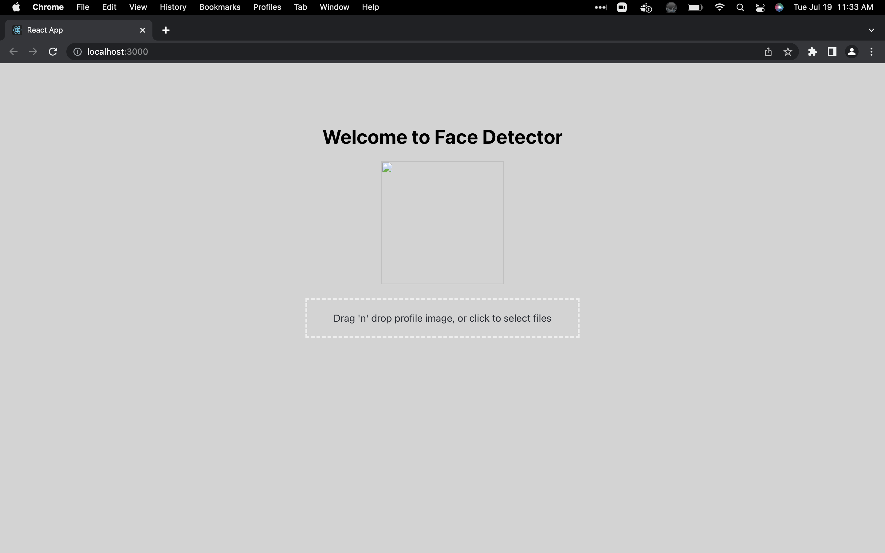
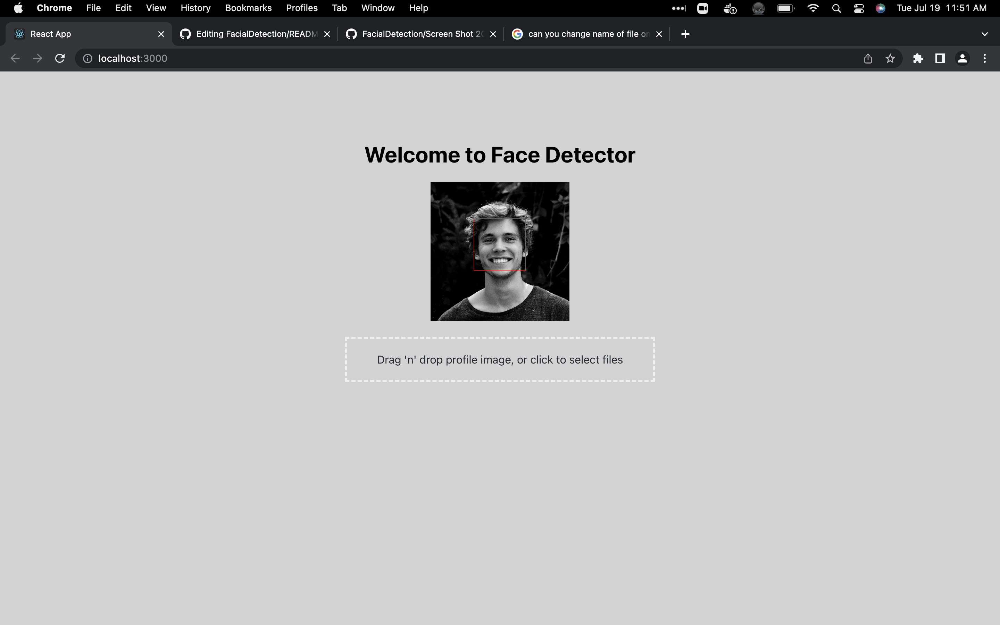

# Facial Detection

Have an image containing any faces?

<div align="center">
    </a>
</div>
<div align="center">
    </a>
</div>

# About
I worked on this project because to learn about RESTful APIs

# Tech stack
<p>
    
</p>


| Frontend |
|---       |
| React.js    |
| Dropzone |
| Webpack |

| Backend |
|---       |
| Node.js  |
| Spring Boot  |
| Java  |
| OpenCV  |


# Local Development

## Setting up the frontend

Requirements: `node`, `npm`

Clone the repository and install npm packages in src/main/frontend:
```
cd src/main/frontend
npm install
```
Start the app:
```
npm start
```
Visit `https://localhost:3000/`

Done!

## Setting up the backend

Done!
