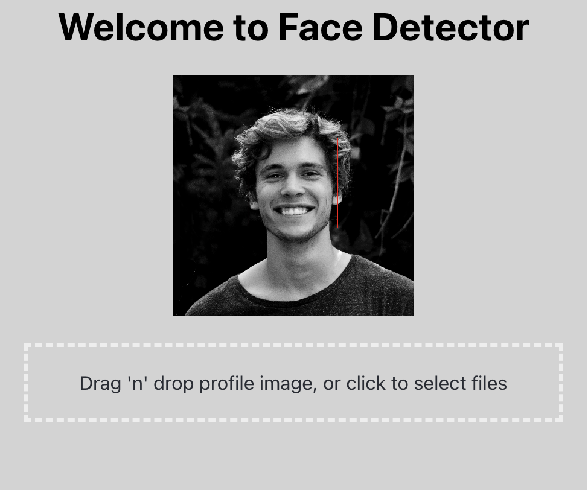

# Facial Detection

Have an image containing faces?

<div align="center">
    </a>
    </a>
</div>

# About
This full stack project allows the user to upload any image to the site. The image will be proccessed on the backend and returned to the sight with all of the human faces boxed/squared.

# Front End
<p>
    
    
    
</p>


| Frontend |
|---       |
| React.js |
| Node.js  |

# Back end
<p>
    
    
    
</p>
          
| Backend |
|---       |
| Spring |
| Java  |
| OpenCV  |


# Local Development

Requirements: `npm` and `maven`

## Setting up the backend

Clone the repository and go to intall location via terminal
```
mvn spring-boot:run
```
## Setting up the frontend

Install npm packages and start app in src/main/frontend:
```
cd src/main/frontend
npm install
npm start
```
Visit `https://localhost:3000/`
